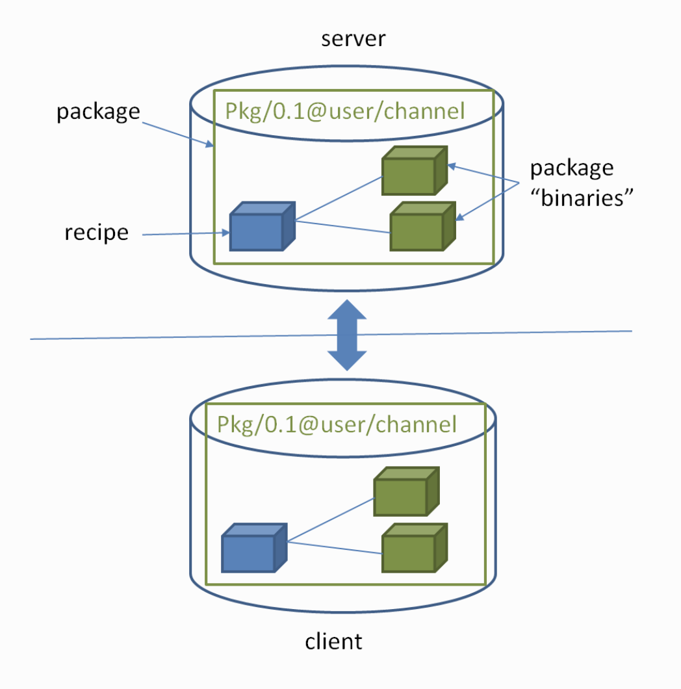
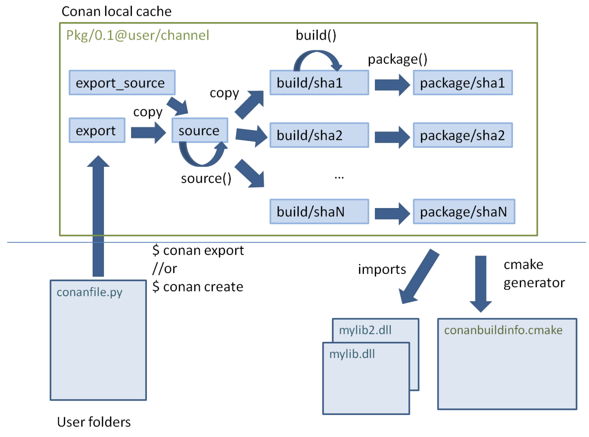
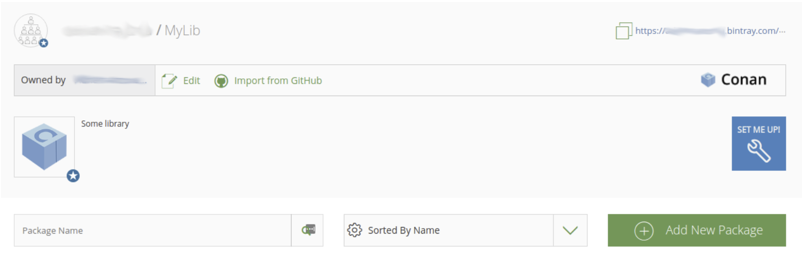

# Conan 简介 

Conan 是一个开源免费跨平台的 c++ 依赖/包管理器，能减轻 C++开发者的负担，有助于持续集成在 C++ 工程实践中的落地。 Conan 是经典的 C/S 架构，开发者可以将包托管于自己的私服或者官方推荐的 [CONANCENTER](https://conan.io/center/)，   [JFrog Bintray](https://bintray.com/) 。

`conan` 的优势在于其通用性，它支持：

- 不同的操作系统（Windows，Linux，macOS，FreeBSD，Android 等等）
- 不同的编译器（gcc，msvc，clang等等）
- 不同的构建工具（CMake，QMake，MSBuild，Autotools等等）
- 不同的构建方式（原生编译，交叉编译等等）

**如果你需要一个 C++ 工程依赖管理的跨平台解决方案，`conan` 是目前唯一开源、成熟、相关生态良性发展的工具**


## 概念梳理：包(package)



我们可以将开发好的工程打成一个 conan package，以便其他工程引用。一个 package 包含了一个 recipe(必须)，编译好的二进制文件(可选) ，recipe 是一个名为` conanfile.py` 的 python 脚本，里面详细定义了如何构建包所对应的C++工程，例如针对不同平台，不同编译器时，应该启用什么参数。 另一个工程使用该包时，就会依据本地环境，运行 recipe 中的不同代码，构建出符合当前环境的二进制文件，从而完成集成。**由此可见，将工程打成 conan 包本质上就是在编写一个 conanfile.py 脚本。**

强调一下，conan server 仅仅是包的存储端，并不负责二进制文件的编译和构建，编译和构建将由客户端完成。C++ 工程的构建是非常耗时的，为了实现持续集成，快速响应，conan 可以直接上传针对不同平台/配置提前编译好的二进制文件，也就是说客户端可以直接拉符合本地配置的二进制文件，跳过构建步骤，缩短整体工程构建时间。 

一个典型的 conan包，包名如下：

```c
zlib/1.2.11@conan/stable
[package_name]/[version]@[user]/[channel]
```

- zlib 包名
- 1.2.11 版本号
- conan 任意字符，可自定义 （官方术语称该字段为 user ）
- stable 任意字符，可自定义 （ 官方术语称该字段为 channel ）


## 如何使用 Conan 包

`conan` 的使用非常简单，首先需要安装 conan 客户端：

```shell
$ pip install conan
```

然后在当前工程中只需要额外加入一个配置文件`conanfile.txt`，用于写明我们需要依赖的包。简单的 conanfile.txt 例子如下，[requires] 表示该工程依赖 gtest ， [generator] 表示 conan install 之后生成的配置文件的类型，种类，本文以 CMake 为例。

```
[requires]
gtest/1.10.0

[generators]
cmake
```

最后执行 install 命令完成包的引入：

```sh
$ conan install .  
# 或绝对路径
$ conan install [conanfile_txt_file_path]
```

至此，成功将 gtest 引入到当前工程中，可以开始写测试了。([参考简单 conan 工程源码](https://github.com/GrandMango/conan_example) )

不使用 conan， 引入 gtest 的方法为，手动拉取 gtest 源码，本地构建，配置编译相关环境变量，例如库查找路径，头文件路径等。程序员的负担很重，换了新环境，又要来一遍，还可能遭遇各种奇怪的问题。 包管理器的使用可以使得不同环境的依赖项配置，都是一句 conan install 就解决了(前提是该包支持当前的编译环境，不支持的话 install 显然会报错失败)。


实际工程中可能的 conanfile.txt 例子如下:

```c
[requires]
gtest/1.10.0
asio/1.13.0
protobuf/3.9.1@bincrafters/stable
grpc/1.25.0@inexorgame/stable
spdlog/1.4.2

[generators]
cmake
cmake_paths
cmake_find_package
```

[generator] 下

- 第一行 cmake 表示当前项目使用的构建工具是 cmake， conan install 后会生成三个 cmake 的配置文件

  - conanbuildinfo.cmake: 其中包含了基本的 CMake环境变量，这个文件需要在项目的 CMakeLists.txt 中导入，例如：

    ```cmake
    include(${CMAKE_BINARY_DIR}/conanbuildinfo.cmake)
    conan_basic_setup() # 设置 global include directories, libraries directories, definitions 
    
    add_executable(my_project my_project.cc)
    target_link_libraries(my_project ${CONAN_LIBS}) # 链接 conan 包
    ```

  - conanbuildinfo.txt:  该文件可供程序员阅读，用来快速检查 conanbuildinfo.cmake 的信息是否正确

  - conaninfo.txt:  内含包的配置信息，例如编译器，系统架构，是Debug 还是 Release 等

> 根据不同工程实际 CMakeLists.txt 文件风格，也可以只使用 cmake 而忽略下面介绍的两个配置项，关于 CMake  的具体讨论超出了本文的范围，读者可自行查阅相应教程

- 第二行 cmake_paths 表示在 install完成之后会生成 `conan_paths.cmake` 文件，其中定义了 `CMAKE_MODULE_PATH` (告诉CMake CMakeList， `FindXXX.cmake` 的查找路径)， `CMAKE_PREFIX_PATH` 等 Cmake 变量，最终使得 Cmake 中的 `find_package()` `find_library()`等语句正常工作。 此时编译时 cmake 命令记得加上  `-DCMAKE_TOOLCHAIN_FILE=conan_paths.cmake`
- 第三行 cmake_find_package 表示 install 完成后要生成 FindXXX.cmake 文件

> 看上去很复杂，但是实际使用上述过程只需配置执行一次，所以工作量并没有想象中的庞大

### Profile

我们以简单 conanfile.txt 为例，引入了一个包，那么如何选择引入的是动态/静态库，debug/release 呢？

```
[requires]
zlib/1.2.11@conan/stable

[generators]
cmake
```

Conan 客户端会创建一个 Profile 文件默认路径 `$HOME/.conan/profiles/default`，例子如下：

```
[settings]
os=Macos
os_build=Macos
arch=x86_64
arch_build=x86_64
compiler=apple-clang
compiler.version=11.0
compiler.libcxx=libc++
build_type=Release
[options]
[build_requires]
[env]
```

```shell
# Profile 文件已经把一些参数给固化下来，可以命令行可以覆盖，上例中 build_type 是 Release， 我们想引入 Debug 版要么修改 Profile 文件，要么命令行覆盖
conan install . -s build_type=Debug

# conan 默认是引入静态库，若想引入动态库可命令行覆盖，也可放在(推荐) conanfile.txt 里，加上 [options]
conan install . -o zlib:shared=True

# [settings] 只能出现在 Profile 里， conan 就是根据这些 setting 识别本地环境，从而拉取/构建正确的包
```

### 依赖冲突

A包依赖 1.1.0版本的 C包，B包依赖1.2.0版本，此时 `conan install` 会报错出现冲突。可以手动强制覆盖，在 [requires] 里声明依赖  package_c/1.2.0@user/channel，解决报错，但依旧会有警告信息，请慎重处理版本问题。


## 如何打包

> conan 的生态还在不断发展，知名度高，常用的软件包基本都有对应的 conan package，但是普通的第三方库很可能是没有 conan 包的，此时可以考虑自行打包(顺便提个 pull request)

打包的过程可以暂时简单理解为，下载源码，编译，得到二进制文件，打包头文件/二进制文件，conan 使用 conanfile.py 脚本(也就是前文提过的 recipe) 定义整个打包的流程，以下为官方教学 recipe 的例子，读者可以运行 `conan new Hello/0.0.1` 命令创建该脚本：

```python
from conans import ConanFile, CMake, tools

class HelloConan(ConanFile):
  	# 定义 conan 包名的前两个参数，包名和版本号
    name = "Hello"
    version = "0.0.1"
    license = "MIT"
    url = "https://github.com/hello/hello.git"
    description = "Hello conan"
    # 从 conan profile 中读取，也可以命令行传递。conan install . -s 参数
    settings = "os", "compiler", "build_type", "arch"
    # 自定义变量， 也可通过 -o 参数传递
    options = {"shared": [True, False]}
    default_options = "shared=False"
    generators = "cmake"

    # 下源码
    def source(self): 
        self.run("git clone https://github.com/hello/hello.git")

    # 编译
    def build(self):
        cmake = CMake(self)
        cmake.configure(source_folder="hello")
        cmake.build()
		# 打包头文件/库文件
    def package(self):
        self.copy("*.h", dst="include", src="hello")
        self.copy("*hello.lib", dst="lib", keep_path=False)
        self.copy("*.dll", dst="bin", keep_path=False)
        self.copy("*.so", dst="lib", keep_path=False)
        self.copy("*.dylib", dst="lib", keep_path=False)
        self.copy("*.a", dst="lib", keep_path=False)
		
    # 添加包的额外信息
    def package_info(self):
        self.cpp_info.libs = ["hello"]
```

> 加上 -t 参数会额外创建 test_package 目录，包含一个引用该包的 cpp 文件，用于检查打包是否正确，是否能被其他 c++ 工程使用

### Step1: 下载源码

定义 source() 方法：

```python
#1 基础下载代码方式
def source(self):
    self.run("git clone https://github.com/openssl/openssl.git")
```

```python
#2 借助辅助工具类下载
source_tgz = "https://www.openssl.org/source/openssl-%s.tar.gz" % version
def source(self):
    tools.download(self.source_tgz, "openssl.tar.gz")
    tools.unzip("openssl.tar.gz")
```

conan 给我们提供了大量的辅助功能我们编写`recipe`，大多集中在`tools`模块里面，比如我们上面用到的`tools.download`和`tools.unzip` ，具体详见[官方文档](https://docs.conan.io/en/latest/reference/tools.html#)

### Step2: 编译

简单场景：

```python
def build(self):
	cmake = CMake(self) # cmake 工具类
	cmake.configure()   # 默认属性
	cmake.build()       # 运行 cmake 命令
```

复杂场景下可以自定义 CMake 属性，例如：

```python
def _cmake_configure(self):
  cmake = CMake(self)
  cmake.definitions["CMAKE_CXX_STANDARD"] = "11"
  cmake.definitions["CAF_NO_AUTO_LIBCPP"] = True
  cmake.definitions["CAF_NO_OPENSSL"] = not self._has_openssl
  for define in ["CAF_NO_EXAMPLES", "CAF_NO_TOOLS", "CAF_NO_UNIT_TESTS", "CAF_NO_PYTHON"]:
    cmake.definitions[define] = "ON"
    if tools.os_info.is_macos and self.settings.arch == "x86":
      cmake.definitions["CMAKE_OSX_ARCHITECTURES"] = "i386"
      cmake.definitions["CAF_BUILD_STATIC"] = self._is_static
      cmake.definitions["CAF_BUILD_STATIC_ONLY"] = self._is_static
      cmake.definitions["CAF_LOG_LEVEL"] = self.default_options['log_level'].index(self.options.log_level.value)
      if self.settings.os == 'Windows':
        cmake.definitions["OPENSSL_USE_STATIC_LIBS"] = True
        cmake.definitions["OPENSSL_MSVC_STATIC_RT"] = True
        elif self.settings.compiler == 'clang':
          cmake.definitions["PTHREAD_LIBRARIES"] = "-pthread -ldl"
          else:
            cmake.definitions["PTHREAD_LIBRARIES"] = "-pthread"
            if self.settings.compiler == "gcc" and Version(self.settings.compiler.version.value) < "5.0":
              cmake.definitions["CMAKE_SHARED_LINKER_FLAGS"] = "-pthread"
              cmake.configure(build_folder=self._build_subfolder)
   return cmake


def build(self):
    cmake = self._cmake_configure()  # 使用自定义 cmake 属性
    cmake.build()
```

而 cmake.build( ) 源码实际为执行：

```python
self.run('cmake %s/[your cmake directory] %s'
	% (self.source_folder, cmake.command_line))
self.run("cmake --build . %s" % cmake.build_config)
```

> 对于复杂编译场景，可以手动使用 self.run( ) 自定义命令。

### Step3: 打包

如果之前项目的 cmake 中定义了打包（cmake install）行为，那么 python 脚本只用显式在 `cmake.build()` 之后调用 `cmake.install()` 即可。如果没有，则使用 conan 脚本提供的 package() 成员函数完成打包，拷贝需要的文件，例如。 

```python
def package(self):
  self.copy("*.h", dst="include", src="hello")
  self.copy("*hello.lib", dst="lib", keep_path=False)
  self.copy("*.dll", dst="bin", keep_path=False)
  self.copy("*.so", dst="lib", keep_path=False)
  self.copy("*.dylib", dst="lib", keep_path=False)
  self.copy("*.a", dst="lib", keep_path=False)
```

> **keep_path** 默认值为 `True`:  表示拷贝的时候是否需要保存相对路径，通常，头文件的拷贝需要保存相对路径，库的拷贝不需要，全部展开在 lib 文件夹即可

### Step4: 配置包的信息

理论上经过上述步骤，打包已经完成，能生成 package 目录，但为了使包的使用者能够正常使用，需要配置，通常需要配置 `self.cpp_info.libs` ，默认使用包时链接哪些库，否则使用者在使用时要手动链接库。

```python
def package_info(self):
	self.cpp_info.libs = ["LIB_NAME"]
```

###  Step5: 运行脚本

```python
conan create . [customized_user_name]/[customized_channel_name]
```

> 还记得文章一开始提到的 conan 包名吗？ 这定义了包名 @之后的两个参数

运行完上述命令，得到的结果通常包含以下目录：

- export 
- export_source  
- source： source() 函数拉取源码             
- build:  每一种不同的配置都会有对应的 build 目录，存放执行build()函数的结果
- package      存放最终经过打包逻辑，最后产出的文件

脚本运行的实际流程如下：



至此，打包已经结束，可以在本地引用包，看是否打包正确，若正确，则接下来需要上传包。

### Step6: 上传包

本文以 JFrog Bintray 包托管平台为例，注册 [JFrog Bintray](https://bintray.com/signup/oss) 账号, 注册成功点击创建 repository， 复制远程库的地址。

 

在本地输入以下命令：

```
conan remote add [customized_remote_name] [remote_url]
```

上传包需要权限，下载使用包不需要，所以上传时，要向远程表明身份。在 JFrog Bintray 用户 profile 页面，获取 API Key，本地输入：

```
conan user -p [API_Key] -r [customized_remote_name] [JFrog_Bintray_username]
```

发布：

```
conan upload -r [remote_name] [package_name]/[version]@[user]/[channel]
```

> 再次强调 [package_name]/[version] 在 recipe 属性中定义，[user]/[channel] 字段根据打包 create 填的参数来填写

### Step7: 使用包

`conan install` 之前记得使用 `conan remote add` 添加远端仓库地址，其余步骤和使用其他包一样。


## Tips:

**实用命令**：

```
conan get [package_info] 可以查看指定包的 recipe 内容
```

```
conan remote list 查看本地远端地址列表
```

```
conan search [package_info] 查询当前能获取到的 package 列表
```

```
conan info .   查看包信息
```

##### 假如我们的包本身，依赖其他包，则需要定义依赖，语法如下：

```python
#1 可以在类中声明 requires 属性
class MyLibConan(ConanFile):
  	...
    requires = [("hello/0.1@user/testing"),
                ("say/0.2@dummy/stable", "override"),
                ("bye/2.1@coder/beta", "private")]
    ...

#2 也可定义 requirements() 方法进行复杂逻辑处理
def requirements(self):
    if self.options.myoption:
        self.requires("zlib/1.2@drl/testing", private=True)
    else:
        self.requires("opencv/2.2@drl/stable", override=True)
```

- **override**：现在需要覆盖依赖的依赖的时候
- **private**： 如果依赖项将被完全嵌入包，并且对使用者隐藏，则可以声明为私有。在某些极端情况下适用，例如必须使用同一库的两个不同版本

**conan 包除了包含 recipe 还可以包含预编译好的二进制文件：**

```python
from conans import ConanFile, CMake, tools

class HelloConan(ConanFile):
    name = "Hello"
    version = "0.0.1"
    license = "MIT"
    url = "https://github.com/hello/hello.git"
    description = "Hello conan"
    settings = "os", "compiler", "build_type", "arch"
    options = {"shared": [True, False]}
    default_options = "shared=False"
    generators = "cmake"

    def package(self):
        self.copy("*")

    def package_info(self):
        self.cpp_info.libs = ["hello"]
```

使用 `export-pkg` 来创建二进制文件：

```
conan export-pkg . Hello/0.0.1@conan/testing
```


## 总结

Conan 为 C++ 的依赖管理提供了不错的解决方案，正如 CMake 逐渐成为现代项目构建方式的主流实践一样， Conan 有望成为未来 C++项目的依赖管理的主流实践。Conan 配合 CMake 将环境配置、项目构建一条龙打通，对于 C++ 的生态，是一件非常有益的事情，但是也不得不再次感叹， C++ 程序员的负担太重了，要思考理解很多繁琐的工程实践。


## 参考资料

[C++包管理器——conan](http://blog.guorongfei.com/2018/04/23/conan-tutorial/)

[conan使用(二)--conan环境搭建](https://blog.csdn.net/weixin_38293453/article/details/109053254)

[Conan C/C++ Package Manager Documentation](https://docs.conan.io/en/latest/introduction.html)

[Creating a C++ package with Conan](https://ncona.com/2019/07/creating-a-cpp-package-with-conan/)
